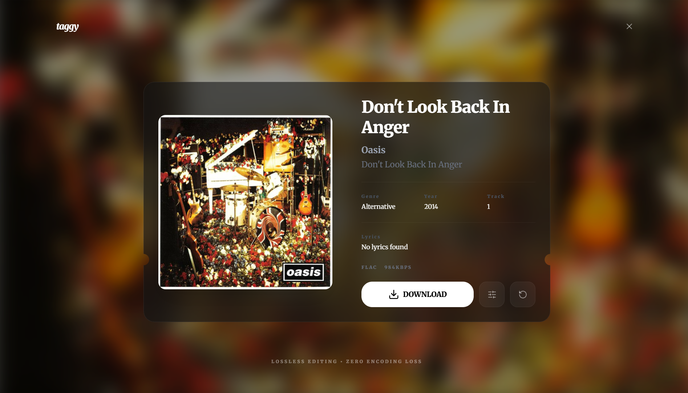

# taggy



> **Lossless editing. Zero encoding loss.**

## 📖 Overview

Most web-based audio tools compromise your music library by quietly re-encoding files during the tagging process, leading to a permanent loss of audio fidelity.

**taggy** is built differently. It's a high-performance web application designed from the ground up for byte-for-byte lossless audio metadata editing. Under the hood, **taggy** utilizes a statically compiled FFmpeg engine and dedicated ID3/Vorbis parsers to surgically inject metadata, high-resolution album art, and ReplayGain loudness data directly into your audio containers.

Your actual audio streams are never touched or re-compressed. You get the convenience of a modern, OLED-first web interface with the uncompromising file integrity of professional desktop software.

---

## ✨ Features

- **Lossless Tagging**: Updates metadata directly inside the audio container (MP3, FLAC, M4A/ALAC, WAV) using stream copying (`-c copy`) and dedicated ID3/Vorbis taggers.
- **Smart Autofill**: Fuzzy search integration with MusicBrainz and Cover Art Archive to auto-populate artist, album, title, year, track number, and high-res cover art.
- **ReplayGain Loudness Tagging**: Built-in peak and track gain calculation via FFmpeg.
- **Drag & Drop Album Art**: Drop any image onto the album art card to instantly swap and embed artwork.
- **Zero-Storage Privacy**: Files exist in ephemeral storage only during active editing and are automatically purged after 10–30 minutes.
- **Embedded FFmpeg**: Cross-platform static binary bundled out-of-the-box — no external tools required.

---

## 🎵 Supported Formats

| Format         | Container      | Writing Engine               | Stream Integrity                  |
| :------------- | :------------- | :--------------------------- | :-------------------------------- |
| **MP3**        | `.mp3`         | `node-id3`                   | 100% Lossless (ID3v2.3 / ID3v2.4) |
| **FLAC**       | `.flac`        | `metaflac` / `ffmpeg-static` | 100% Lossless (Vorbis Comments)   |
| **M4A / ALAC** | `.m4a`, `.mp4` | `ffmpeg-static` (`-c copy`)  | 100% Lossless Stream Copy         |
| **WAV**        | `.wav`         | `ffmpeg-static` (`-c copy`)  | 100% Lossless Stream Copy         |

---

## 🚀 How to Setup

### Prerequisites

- **Node.js** 18.x, 20.x, or 22.x

### Installation & Local Run

1. Clone the repository:

   ```bash
   git clone https://github.com/ayushjsgithub/taggy.git
   cd taggy
   ```

2. Install dependencies:

   ```bash
   npm install
   ```

3. Run the development server:

   ```bash
   npm run dev
   ```

4. Open [http://localhost:3000](http://localhost:3000) in your browser.

---

## 📁 Project Architecture

```text
├── app/                  # Next.js App Router UI & API routes
│   ├── api/              # Upload, update, autofill & background-art endpoints
│   └── page.jsx          # Interactive MusicCard editor component
├── lib/                  # Audio engines, handlers, and external services
│   ├── handlers/         # Format-specific lossless handlers (mp3, flac, m4a)
│   ├── audio-engine.js   # Orchestrator for reading and writing tags
│   ├── ffmpeg.js         # Centralized static FFmpeg helper
│   ├── musicbrainz.js    # Search & Cover Art Archive integration
│   └── replaygain.js     # Track loudness analysis
├── public/               # Static assets and fallback background art
├── temp/                 # Ephemeral working directory (auto-purged)
└── next.config.mjs       # Next.js configuration
```

---

## 📄 License

MIT License. Free and open source.
